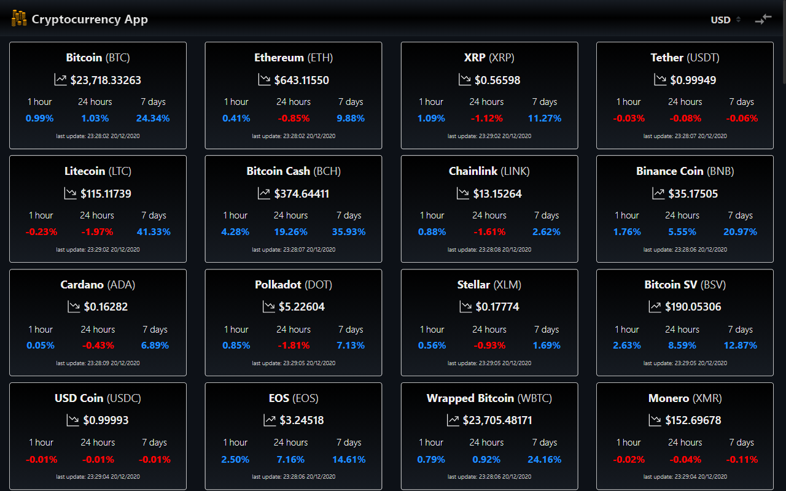
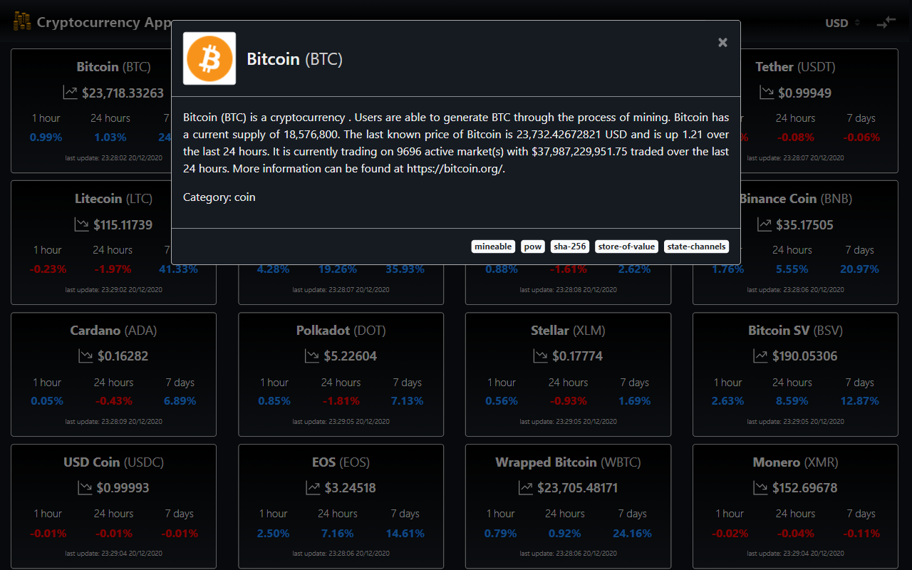
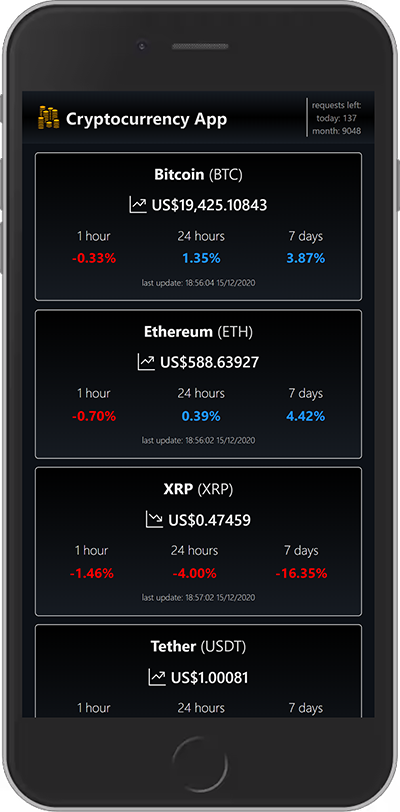
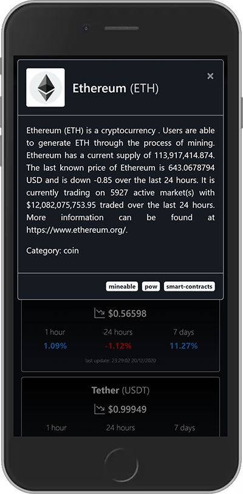
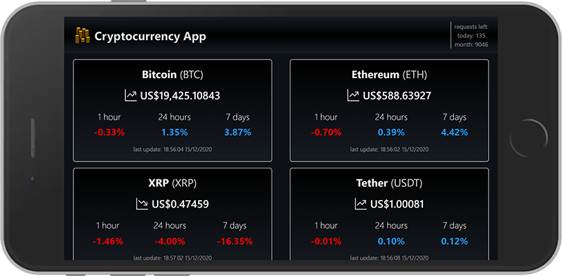
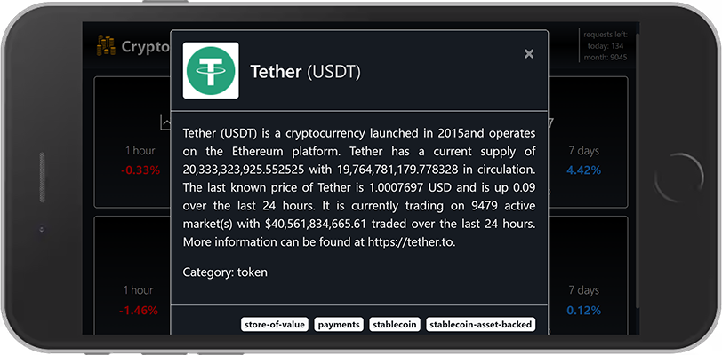

# Digital Innovation One

## Requisitando dados de uma API de criptomoedas

Esse exercício abordou conceitos e técnicas de manipulação de APIs, com a integração de uma *Single Page Application* (SPA) em React com a [CoinMarketCap API][coinmarketcap-api].

### 🖱 [Clique aqui para ver online.][react-frontend-app]

---

### ⚔ Desafio

Consumir os recursos da [CoinMarketCap API][coinmarketcap-api] em um *frontend*.

#### 🛑 Problema

A API RESTful fornecida pela **CoinMarketCap** não permite a requisição de recursos por JavaScript diretamente no *frontend*, sendo bloqueada pela configuração do CORS (*Cross-Origin Resource Sharing*) a fim de proteger a visibilidade da minha *API Key*.

> *Making HTTP requests on the client side with Javascript is currently prohibited through CORS configuration. This is to protect your API Key which should not be visible to users of your application so your API Key is not stolen. Secure your API Key by routing calls through your own backend service.*

#### ⚠ Tentativa

Para contornar essa questão do CORS, tentei utilizar o [https://cors-anywhere.herokuapp.com/][cors-anywhere], um *Node.js app* que possibilita requisições *cross-origin* para qualquer lugar, mas a "solução" se mostrou instável e o acesso à **CoinMarketCap API** ficava indisponível em alguns momentos.

#### ✅ Solução

Além de criar o *frontend*, também desenvolvi um *middleware* na forma de uma aplicação **Node.js** para realizar a integração entre a **CoinMarketCap API** e o *React app*. Esse *middleware* não apenas me permitiu esconder a minha *API Key*, mas também restringir os *requests* através das minhas configurações do CORS, aceitando apenas as requisições com origem em [https://leonardosposina.github.io][react-frontend-app] via scripts em navegador.

- Integration Middleware API: [https://dio-crypto-api.herokuapp.com/][middleware-app].
- Repositório: [https://github.com/leonardosposina/coinmarketcap-integration-middleware][middleware-repo].

---

### 📷 Screenshots

---

### Referências

- [Cross-Origin Resource Sharing (CORS)][cors-ref]
- [CORS Anywhere (Repo)][cors-anywhere-repo]

[react-frontend-app]: https://leonardosposina.github.io/dio-cryptocurrency-api-integration/
[coinmarketcap-api]: https://coinmarketcap.com/api/
[cors-anywhere-app]: https://cors-anywhere.herokuapp.com/
[middleware-app]: https://dio-crypto-api.herokuapp.com/
[middleware-repo]: https://github.com/leonardosposina/coinmarketcap-integration-middleware
[cors-ref]:https://developer.mozilla.org/pt-BR/docs/Web/HTTP/Controle_Acesso_CORS
[cors-anywhere-repo]:https://github.com/Rob--W/cors-anywhere/
